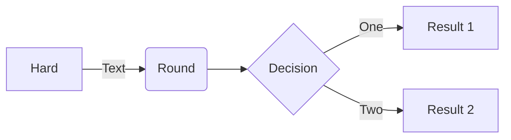
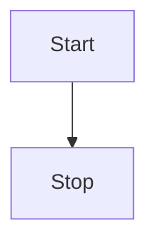

# Architecture

- Test
  

```mermaid
  graph TD;
      A-->B;
      A-->C;
      B-->D;
      C-->D;
```

- Test

```mermaid
    flowchart LR
    A[Hard] -->|Text| B(Round)
    B --> C{Decision}
    C -->|One| D[Result 1]
    C -->|Two| E[Result 2]
```

- Test

```mermaid
flowchart TD
    Start --> Stop
```

- Test

```mermaid
flowchart LR
    id1[This is the text in the box]
```